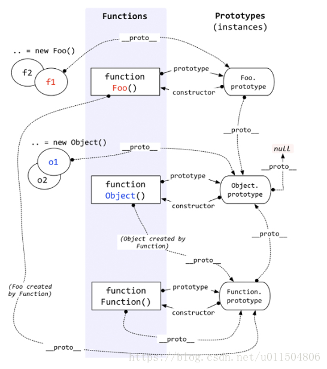

## 原型和继承

### 前言

#### 函数与对象的关系

- 函数是对象的一种

```javascript
var fn = function Fn(){
  this.name = '测试';
  this.year = 1998;
}
console.log(fn instanceof Object) //true
```

- 对象都是通过函数创建的

```javascript
//这样创建对象是js的语法糖
var obj = {a:10,b:20,c:30}
//本质上是下面这样创建的
//var obj = new Object();
//obj.a = 10; obj.b = 20; obj.c = 30; 
```

### 基本概念

#### **原型--------prototype对象**

每个函数都有一个属性prototype,默认prototype对象只有一个constructor属性，指向函数本身。


我们也可以在prototype对象中增加自己定义的属性

```javascript
function Fn(){
  Fn.prototype.name = '阿飞';
  Fn.prototype.getName = function(){
    return this.name;
  }
}
```

**每个对象都有一个隐藏属性`__proto__`指向创建了这个对象的原型对象prototype**

```javascript
var fn = new Fn();
console.log(fn.__proto__ == Fn.prototype);  //true
```

**Object的原型对象的`__proto__` 指向null**

```javascript
console.log(Object.prototype.__proto__); //null
```

**Function的原型对象的`__proto__` 指向自身**

Function也是一个函数，函数也是一种对象，也有`__proto__` 属性，Function因为是函数，所以是被自身创建的，所以它的`__proto__`指向了自身的prototype



#### instanceof判断规则

判断`A instanceof B`，A一般是一个对象，B一般是一个函数，沿着A的`__proto__`这条线找，同时沿着B的prototype这条线找，如果两条线能找到同一个对象引用，则返回true.如果到终点还没找到同一个对象引用，则返回false

### 继承

#### 原型链

```javascript
function Foo(){}

var f1 = new Foo();
f1.a = 100;
Foo.prototype.a = 10;
Foo.prototype.b = 200;
console.log(f1.a);//100
console.log(f1.b);//200

var f2 = new Foo();
console.log(f2.a);//10
```

**当访问一个对象的属性时，会先在基本属性中查找，如果没有，再沿着`__proto__`这条链向上找，这就是原型链**

当我们要区分一个属性是对象本身的还是从原型上找到的，使用Object.prototype原型对象上的**hasOwnProperty**方法来判断

```javascript
function Foo(){}

var f1 = new Foo();
f1.a = 100;
Foo.prototype.a = 10;
Foo.prototype.b = 200;
for(let item in f1){
  if(f1.hasOwnProperty(item)){
    console.log(item); //a
  }
}
```


#### 原型链继承

使用原型链实现SubType继承SuperType,通过创建SuperType的实例并将其赋值给SubType的原型对象prototype，这个赋值重写了SubType最初的原型对象，意味着SuperType实例可以访问的所有属性和方法也会存在于SubType的原型对象上。

```javascript
function SuperType(){
  this.property = true;
}
SuperType.prototype.getSuperValue = function(){
  return this.property;
}
function SubType(){
  this.subproperty = false;
}
//SubType继承SuperType
SubType.prototype = new SuperType();
SubType.prototype.getSubValue = function(){
  return this.subproperty;
}
let childType = new SubType();
console.log(childType.getSuperValue());//true
```

- 原型链的问题

1.在原型中包含引用值的时候，会在所有实例间共享，下面这个例子揭示了这个问题

```javascript
function SuperType(){
  this.colors = ['red','blue','green'];
}
function SubType(){}
SubType.prototype = new SuperType();
let instance1 = new SubType();
instance1.colors.push("black");
console.log(instance1.colors);//['red','blue','green','black']
let instance2 = new SubType();
console.log(instance2.colors);//['red','blue','green','black']
```

2.子类型在实例化时不能给父类型的构造函数传参


#### 盗用构造函数（对象伪装、经典继承）

在子类构造函数中调用父类构造函数，因为函数是在特定上下文中执行代码的简单对象，所以可以使用apply()和call()方法以新创建的对象为上下文执行构造函数。

```javascript
function SuperType(){
  this.colors = ['red','blue','green'];
}
function SubType(){
  //继承SuperType
  SuperType.call(this);
}
let instance1 = new SubType();
instance1.colors.push('black');
console.log(instance1.colors);//['red','blue','green','black']
let instance2 = new SubType();
console.log(instance2.colors);//['red','blue','green']
```

**传递参数**

盗用构造函数的一个优点是可以在子类构造函数中向父类构造函数传参。

```javascript
function SuperType(name){
  this.name = name;
}
function SubType(){
  //继承SuperType并传参
  SuperType.call(this,'nihao');
  //示例属性
  this.age = 29;
}

let instance = new SubType();
console.log(instance.name);//'nihao'
console.log(instance.age);//29
```

SuperType构造函数接受一个参数name,然后将它赋值给一个属性。在SubType构造函数中调用SuperType构造函数时传入这个参数，实际上是在SubType的实例上定义name属性。

为确保SuperType构造函数不会覆盖SubType定义的属性，可以在调用父类构造函数之后再给子类实例添加额外的属性。

- 盗用构造函数的问题

1.必须在构造函数中定义方法，函数不能重用。

2.子类不能访问父类原型对象上定义的方法。


#### 组合继承(伪经典继承)

组合继承综合了原型链和盗用构造函数，将两者的优点集中了起来。

基本思路是使用原型链继承原型上的属性和方法，通过盗用构造函数继承实例属性。

```javascript
function SuperType(name){
  this.name = name;
  this.colors = ['red','blue','green'];
}
SuperType.prototype.sayName = function(){
  console.log(this.name);
}
function SubType(name,age){
  SuperType.call(this,name);
  this.age = age;
}
SubType.prototype = new SuperType();
SubType.prototype.sayAge = function(){
  console.log(this.age);
}

let instance1 = new SubType('nihao',29);
instance1.colors.push('black');
console.log(instance1.colors);//['red','blue','green','black']
instance1.sayName();//'nihao'
instance1.sayAge();//29

let instance2 = new SubType('wohao',28);
console.log(instance1.colors);//['red','blue','green']
instance1.sayName();//'wohao'
instance1.sayAge();//28
```

组合继承弥补了原型链和盗用构造函数的不足，是js中使用最多的继承模式。组合继承也保留了instanceof操作符合isPrototypeOf()方法识别合成对象的能力。


#### 原型式继承

ES5通过Object.create()方法将原型式继承的概念规范化了，这个方法接收两个参数，作为新对象原型的对象，以及给新对象定义额外属性的对象。

```javascript
let person = {
  name:'wpf',
  friends:['aa','bb']
}
let otherPerson = Object.create(person,{
  name:{
    value:'huanhuan'
  }
});
otherPerson.friends.push("dd");
console.log(person.friends);//['aa','bb','dd']

```

原型式集成非常适合不需要单独创建构造函数，但仍然需要在对象间共享信息的场合。但要记住 ，属性中包含的引用值始终会在相关对象间共享，跟使用原型模式一样。


#### 寄生式继承

寄生式继承背后的思路类似于寄生构造函数和工厂模式：创建一个实现继承的函数，以某种方式增强对象，然后返回这个对象。

```javascript
function createAnother(original){
  let clone = object(original);
  clone.sayHi = function(){
    console.log('hi');
  }
  return clone;
}
```

createAnother()函数接收一个参数，就是新对象的基准对象。

```js
let person = {
	name: 'nicholas',
  friends:['aa','bb']
}
let anotherPerson = createAnother(person);
anotherPerson.sayHi();//hi
```

> 注意：通过寄生式继承给对象添加函数会导致函数难以重用，与构造函数模式类似


#### 寄生式组合继承

组合继承存在效率问题：父类的构造函数始终会被调用两次，一次是在创建子类原型对象时调用，另一次是在子类构造函数中调用。

本质上，子类原型最终是要包含超类对象的所有实例属性，子类构造函数只要在执行时重写自己的原型就行了。

寄生式组合继承通过盗用构造函数继承属性，但是用混合式原型链继承方法。

基本思路是取得父类原型的一个副本。寄生式组合继承的基本模式如下：

```js
function inheritPrototype(subType,superType){
  let prototype = object(superType.prototype);//创建对象
  prototype.constructor = subType;
  subType.prototype = prototype;
}
```

这个inheritPrototype()函数实现了寄生式组合继承的核心逻辑。

这个函数接收两个参数：子类构造函数和父类构造函数。在这个函数内部，第一步是创建父类原型对象的副本，然后将副本的constructor指向子类构造函数，解决了由于重写原型导致默认constructor丢失的问题。最后将副本对象赋值给子类型的原型。

```js
function SuperType(name){
  this.name = name;
  this.colors = ['red','blue'];
}
SuperType.prototype.sayName = function(){
  console.log(this.name);
}
function SubType(name,age){
	SuperType.call(this,name);
  this.age = age;
}
inheritPrototype(SubType,SuperType);
SubType.prototype.sayAge = function(){
  console.log(this.age);
}
```

这里只调用了一次SuperType构造函数，避免了SubType.prototype上不必要也用不到的属性，而且原型链仍然保持不变，instanceof操作符和isPrototypeOf（）方法正常有效。

寄生式组合继承可以算是引用类型继承的最佳模式。


### 类

类(class)是ES6中心的基础性语法糖结构，背后使用的仍是原型和构造函数的概念。

#### 类定义

定义类有两种主要方式：类声明和类表达式。

```js
//类声明
class Person{}
//类表达式
const Animal = class {};
```

- 函数声明可以提升，类定义不能提升。
- 函数受函数作用域限制，类受块作用域限制。

把类表达式赋值给变量后，可以通过name属性取得类表达式的名称字符串。

```js
let Person = class PersonName{
  identify(){
    console.log(Person.name,PersonName.name);
  }
}
let p = new Person();
p.identify(); //PersonName PersonName
console.log(Person.name); //PersonName
console.log(PersonName); //ReferenceError: PersonName is not defined
```


#### 类的构成

类可以包含构造函数方法、实例方法、获取函数、设置函数和静态类方法。默认情况下，类的代码都在严格模式下执行。

```js
class Foo{
  constructor(){} //构造函数
  get myFoo(){} //获取函数
  static myFooStatic(){} //静态方法
}
```

##### 构造函数

constructor关键字用于在类定义块内部创建类的构造函数。在使用new操作符创建类的新实例时会调用这个函数。

使用new调用类的构造函数会执行以下操作：

1. 在内存中创建一个新对象。

2. 这个新对象内部的[[Prototype]]指针被赋值为构造函数的prototype属性。

3. 构造函数内部的this被赋值为这个新对象(即this指向新对象)。
4. 执行构造函数内部的代码。
5. 如果构造函数返回非空对象，则返回对象;否则返回刚创建的新对象。

默认情况下，类构造函数会在执行之后返回this对象。构造函数返回的对象会被用作实例化的对象，如果没有什么引用新创建的this对象，那么这个对象会被销毁。

如果类构造函数返回的不是this对象，而是其他对象，那么这个对象不会通过instanceof操作符检测出跟类有关联，因为这个对象的原型指针没有被修改。

```js
class Person {
  constructor(override){
    this.foo = 'foo';
    if(override){
      return {
        bar: 'bar'
      }
    }
  }
}
let p1 = new Person(),
    p2 = new Person(true);
console.log(p1);										//Person{ foo: 'foo'}
console.log(p1 instanceof Person);	//true
console.log(p2);										//{bar:'bar'}
console.log(p2 instanceof Person);  //false
```

类构造函数必须使用new操作符，不用new操作符会报错。

##### 原型方法与访问器

类定义语法把在类块中定义的方法作为原型方法。

```js
class Person {
  constructor(){
    // 添加到 this 的所有内容都会存在于不同的实例上
    this.locate = () => console.log('instance');
  }
  // 在类块中定义的所有内容都会定义在类的原型上
  locate(){
    console.log('prototype');
  }
}

let p = new Person();
p.locate();
Person.prototype.locate(); //prototype
```

类方法等同于对象属性，可以使用字符串、符号或计算的值作为键：

```js
const symbolKey = Symbol('symbolKey');
class Person {
  stringKey(){
    console.log('invoked stringKey');
  }
  [symbolKey](){
    console.log('invoked symbolKey');
  }
  ['computed' + 'Key'](){
    console.log('invoked computedKey');
  }
}
let p = new Person();
p.stringKey(); //invoked stringKey
p[symbolKey](); //invoked symbolKey
p.computedKey(); //invoked computedKey
```

类定义也支持获取和设置访问器，语法与行为跟普通对象一样：

```js
class Person {
  set name(newName) {
    this.name_ = newName;
  }
  get name(){
    return this.name_;
  }
}
let p = new Person();
p.name = 'Jake';
coonsole.log(p.name); //Jake
```

##### 静态类方法

```js
class Person {
  constructor(){
    // 添加到this的所有内容都会存在于不同的实例上
    this.locate = () => console.log('instance',this);
  }
  // 定义在类的原型对象上
  locate(){
    console.log('prototype',this);
  }
  // 定义在类本身上
  static locate(){
    console.log('class',this);
  }
}
let p = new Person();
p.locate(); ///instance,Person{}
Person.prototype.locate(); //prototype,{constructor:...}
Person.locate(); //class,class Person {}
```

静态类方法非常适合作为实例工厂

```js
class Person {
  constructor(age){
    this.age_ = age;
  }
  sayAge(){
    console.log(this.age_);
  }
  static create(){
    //使用随机年龄创建并返回一个Person实例
    return new Person(Math.floor(Math.random()*100));
  }
}
console.log(Person.create());	// Person {age_: ...}
```


#### 继承

使用extends关键字，就可以继承任何拥有[[Construct]]和原型的对象。

```js
class Vehicle {}

//继承类
class Bus extends Vehicle{}

let b = new Bus();
console.log(b instanceof Bus); //true
console.log(b instanceof Vehicle); //true

function Person() {}
//继承构造函数
class Engineer extends Person{}
let e = new Engineer();
console.log(e instanceof Engineer); //true
console.log(e instanceof Person); //true
```

extends关键字也可以在类表达式中使用。

```js
let Bar = class extends Foo {}
```

##### 构造函数、HomeObject和super()

```js
class Vehicle {
  constructor() {
    this.hasEngine = true;
  }
}
class Bus extends Vehicle {
  constructor() {
    // 不要在调用super()之前引用this 否则会抛出ReferenceError
    super(); //相当于super.constructor()
    console.log(this instanceof Vehicle); //true
    console.log(this); //Bus{ hasEngine:true }
  }
}
new Bus();
```

在静态方法中可以通过super调用继承的类上定义的静态方法

```js
class Vehicle {
  static identify(){
    console.log('vehicle');
  }
}
class Bus extends Vehicle {
  static identify() {
    super.identify();
  }
}
Bus.identify(); //vehicle
```

> ES6给类构造函数和静态方法加了内部特性[[HomeObject]],这个特性是一个指针,指向定义该方法的对象。这个指针是自动赋值的，而且只能在js引擎内部访问。super始终会定义为[[HomeObject]]的原型

使用super时要注意几个问题：

- super只能在派生类构造函数和静态方法中使用

```js
class Vehicle {
  constructor() {
    super();
    //SyntaxError: 'super' keyword unexpected here
  }
}
```

- 不能单独引用super关键字，要么用它调用构造函数，要么用它引用静态方法
- 调用super()会调用父类构造函数，并将返回的实例赋值给this
- super()的行为如同调用构造函数，如果需要给父类构造函数传参，则需要手动传入

```js
class Vehicle {
  constructor(licensePlate){
    this.licensePlate = licensePlate;
  }
}
class Bus extends Vehicle {
  constructor(licensePlate){
    super(licensePlate);
  }
}
console.log(new Bus('123333')); //Bus {licensePlate:'123333'}
```

- 如果没有定义类构造函数，在实例化派生类时会调用super(),而且会传入所有传给派生类的参数。

```js
class Vehicle {
  constructor(licensePlate){
    this.licensePlate = licensePlate;
  }
}
class Bus extends Vehicle {}
console.log(new Bus('1337H4X')); //Bus { licensePlate: '1337H4X' }
```

- 在类构造函数中，不能在调用super()之前引用this

```js
class Vehicle {}
class Bus extends Vehicle {
  constructor() {
    console.log(this);
  }
}
new Bus();
//ReferenceError: Must call super constructor in derived class 
// before accessing 'this' or returning from derived constructor
```

- 如果在派生类中显式定义了构造函数，则要么必须在其中调用super(),要么必须在其中返回一个对象

```js
class Vehicle {}
class Car extends Vehicle {}
class Bus extends Vehicle {
  constructor(){
    super();
  }
}
class Van extends Vehicle {
  constructor(){
    return {};
  }
}
console.log(new Car()); //Car {}
console.log(new Bus()); //Bus {}
console.log(new Van()); //{}
```

#### 抽象基类

抽象基类可供其他类继承,本身不能被实例化。ECMAScript通过new.target检测是不是抽象基类，可以阻止对抽象基类的实例化：

```js
//抽象基类
class Vehicle {
  constructor(){
    console.log(new.target);
    if(new.target === Vehicle){
      throw new Error('Vehicle cannot be directly instantiated');
    }
  }
}
//派生类
class Bus extends Vehicle {}
new Bus(); //class Bus{}
new Vehicle(); //class Vehicle {} // Error: Vehicle cannot be directly instantiated
```

通过在抽象基类构造函数中检查，可以要求派生类必须定义某个方法。因为原型方法在调用类构造函数之前就已经存在了，可以通过this关键字来检查相应的方法：

```js
//抽象基类
class Vehicle {
  constructor(){
    if(new.target === Vehicle){
      throw new Error('Vehicle cannot be directly instantiated');
    }
    if(!this.foo){
      throw new Error('Inheriting class must define foo()');
    }
    console.log('success!');
  }
}

//派生类
class Van extends Vehicle {
  foo() {}
}

//派生类
class Van extends Vehicle {}

new Bus(); // success!
new Van(); // Error: Inheriting class must define foo()
```


#### 类混入

把不同类的行为集中到一个类是一种常见的JavaScript模式。

> Object.assign()方法是为了混入对象行为而设计的。只有在需要混入类的行为时才有必要自己实现混入表达式。如果只是需要混入多个对象的属性，那么使用Object.assign()就可以了。


